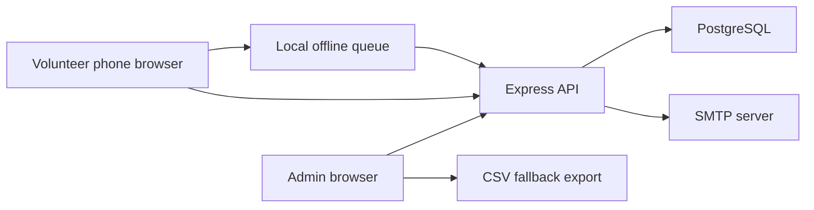
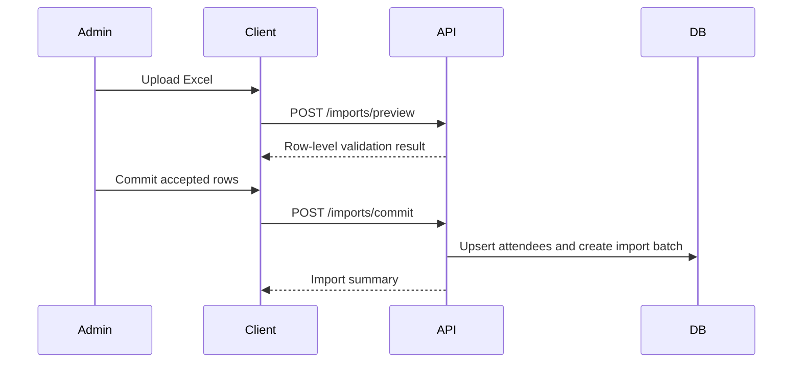
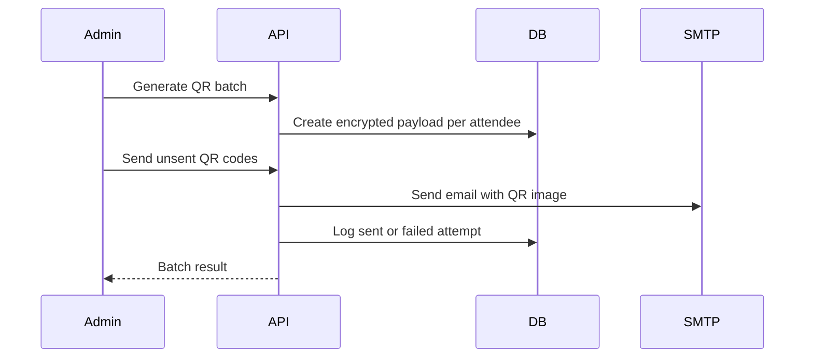
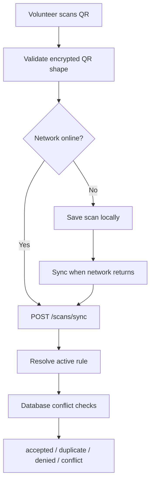

# Architecture

## System Overview

Reg Desk is split into a React frontend, Express API, and PostgreSQL database. The browser is used for both admin operations and volunteer scanning. PostgreSQL remains the only source of truth for attendee records, QR code state, email attempts, rules, and scan events.

## Frontend Responsibilities

The React frontend owns:

- Login/session UI.
- Admin import and registration screens.
- QR batch and sending controls.
- Volunteer scanner screen.
- Offline scan queue storage in browser local storage for V1.
- PWA manifest and service worker registration for installability and offline app-shell caching.
- Dashboard visualization and polling.

The frontend never becomes authoritative for scan acceptance. Even when it queues offline scans, final acceptance happens on the server during sync.

## Installable Offline Web App

The client includes a web app manifest and service worker. Browsers can install it to the home screen or desktop, and the service worker caches the application shell so volunteers can reopen the scanner screen during weak connectivity.

API writes are not cached by the service worker. Offline scan resilience is handled by the scanner queue, which stores pending scan payloads locally and syncs them when the backend becomes reachable.

## Backend Responsibilities

The Express API owns:

- Authentication and role enforcement.
- Excel parsing and import commit.
- Attendee creation and search.
- QR payload encryption and QR metadata storage.
- SMTP sending and send attempt logging.
- CSV fallback export.
- Scan rule evaluation.
- Scan idempotency and duplicate prevention.
- Dashboard aggregate endpoints.

## Database Responsibilities

PostgreSQL owns:

- Durable attendee and event state.
- Unique attendee email constraints.
- One QR code per attendee.
- Idempotent scan sync using `local_scan_id`.
- Duplicate resource prevention using partial unique constraints.
- Audit trail persistence.

## Import Flow

## QR Send Flow

## Scanner Flow

## Realtime Statistics

V1 uses dashboard polling every few seconds. This avoids WebSocket deployment complexity while still giving organizers useful live visibility. Server-sent events or WebSockets can be added later without changing the underlying stats queries.
