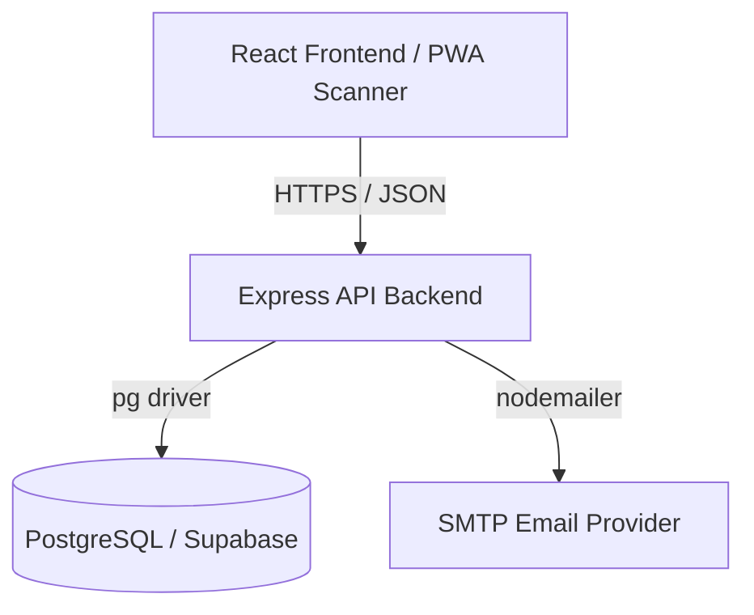

# Architecture

Amaze Reg Desk is built as a modular monolithic application deployed serverlessly. It consists of a React frontend and an Express backend, sharing TypeScript types.

## High-Level Topology

## System Components

### 1. Frontend (Client)
- **Framework**: React 19 + TypeScript + Vite.
- **Routing**: Client-side routing. Vercel routing configuration (`vercel.json`) ensures paths correctly resolve to `index.html`.
- **PWA Capabilities**: 
  - Uses `manifest.webmanifest` and `sw.js` for offline caching of app shells and icons.
  - Automatically installable on Android and iOS ("Add to Home Screen").
- **State Management**: Context/State-based global settings. Theme colors are injected directly into `document.documentElement` dynamically.

### 2. Backend (Server)
- **Framework**: Express with TypeScript. Hosted as Serverless Functions on Vercel.
- **QR Generation**: In-memory generation using `qrcode` and `crypto` (AES-256-GCM).
- **Email Engine**: 
  - Dynamic `{{variable}}` string interpolation engine targeting user `metadata` custom fields.
  - Generates HTML emails with embedded CIDs for the QR code attachment.
- **Validation**: Strict `zod` schema parsing on all incoming requests to ensure type safety before DB execution.

### 3. Database Layer
- **Driver**: Raw `pg` SQL queries mapping directly to schema interfaces.
- **Flexibility**: The `metadata` column in the `attendees` table utilizes `JSONB` for schema-less data extension, powering the Dynamic Form Builder without requiring constant schema migrations.

## Key Feature Architectures

### Dynamic Branding & Settings
Settings are stored as key-value string pairs in the `system_settings` table. On app initialization, the frontend performs a pre-flight fetch to `/settings` and populates the global `globalSettings` state. This controls CSS Custom Properties, Logo injection, and the visibility of Public Forms.

### Verification Queue
Public registration and ticket transfers inject rows into `attendees` with a specific JSONB payload: `{ "verificationStatus": "pending", "paymentProof": "data:image/..." }`. The admin dashboard polls for these records, rendering them in a queue. An approval action scrubs the pending status, allowing QR generation.

### Sync & Offline Scanning
Volunteers using the PWA scanner can perform scans without network access. Scans are logged locally in memory. Upon regaining connectivity, a background process flushes the queue to `POST /scans/sync`. The backend is idempotent against duplicate sync attempts due to `client_id` unique constraints on `scan_events`.
